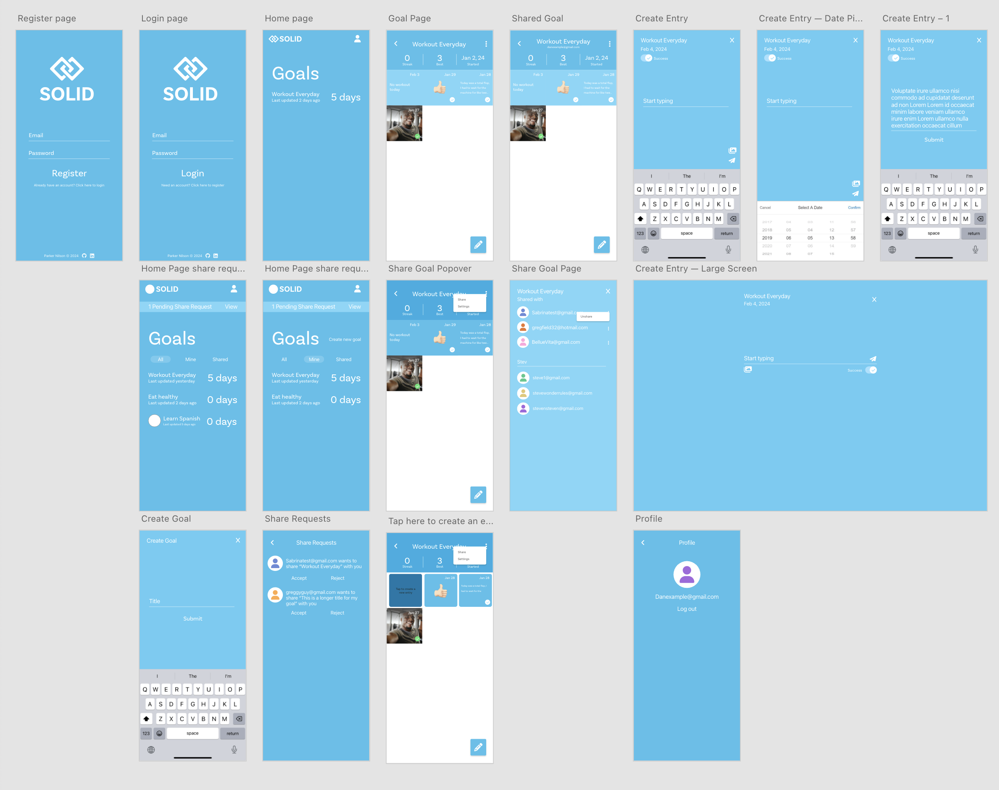

# Solid App
A goal sharing app where you make a daily goal and share it with your friends to build accountability and community.

# Technical Overview
## Data ERD

## Tech Stack

Backend will be hosted on Supabase, using mostly Postgres Functions for authenticated / authorized backend logic. Edge Functions will be used where more complex logic and/or integrations with other services are required.

Frontend will be written as a SvelteKit SPA hosted from an AWS S3 bucket through CloudFront. We will use a service worker to implement web push notifications and support PWA.

# UX Overview
## UX Prototype

# Roadmap
As of Mar 14, I have implemented the backend and frontend to support everything in the UX prototype except for the Modify Entry modal and the Share Goal modal.

The goal for the next 4 weeks is to:

- [ ] complete the frontend as specified in the UX Prototype.
- [ ] Implement service worker for notifications
- [ ] Send notifications upon daily completion of goal to users it is shared with
- [ ] Send reminder notifications to user to complete goal each day
- [ ] Deploy backend to Supabase
- [ ] Deploy frontend to S3
- [ ] Bonus: Implement CI/CD for backend and frontend deployments
- [ ] Bonus: Implement PWA support

## 3/19
Start the Modify Entry modal and the Share Goal modal
## 3/26
Complete the Modify Entry modal and the Share Goal modal
## 4/2
Implement service worker for notifications
## 4/9
Send notifications on daily completion
Send notifications for daily reminder
## 4/16
Deploy backend and frontend